# Cinema Fullstack

Full-stack **Cinema Shop**: a Django REST API backend connected to a Vue + Vite frontend.

## Task

You already have Backend and Frontend implemented.
You need to connect them together, and make sure all functionality of Cinema Shop works.

> **NOTE:** Attach screenshots of all pages from the correctly connected frontend.
> Better to make them with the opened developer tool, where the requests to the
> API will be shown.

## Tech stack

- **Backend:** Django 5, Django REST Framework, SimpleJWT, PostgreSQL (Docker)
- **Frontend:** Vue 2, Vite, Axios
- **Auth:** JWT (access / refresh)
- **CORS:** `django-cors-headers`
- **API docs:** drf-spectacular (Swagger)

## How to run

### 1. Backend (Docker)

Create a `.env` file in the **project root**:

```env
POSTGRES_HOST=db
POSTGRES_DB=cinema
POSTGRES_USER=cinema
POSTGRES_PASSWORD=cinema
```

Build the containers, load the sample data and create an admin user:

```bash
docker compose up -d --build
docker compose cp sample_cinema.json app:/tmp/sample_cinema.json
docker compose exec app python manage.py loaddata /tmp/sample_cinema.json
docker compose exec app python manage.py createsuperuser
```

The API is available at **http://127.0.0.1:8080**.

### 2. Frontend (Vite)

Create a `.env` file inside the **`frontend/`** folder:

```env
VITE_API_URL=http://127.0.0.1:8080
```

Install dependencies and start the dev server:

```bash
cd frontend
npm install
npm run dev
```

The UI is available at **http://localhost:5173**.

> CORS is enabled on the backend via `django-cors-headers`, so the frontend
> origin (`localhost:5173`) is allowed to call the API on `localhost:8080`.

## API documentation (Swagger)

Interactive API docs are generated automatically with `drf-spectacular`:

- **Swagger UI:** http://127.0.0.1:8080/api/doc/swagger/
- **ReDoc:** http://127.0.0.1:8080/api/doc/redoc/
- **OpenAPI schema:** http://127.0.0.1:8080/api/schema/

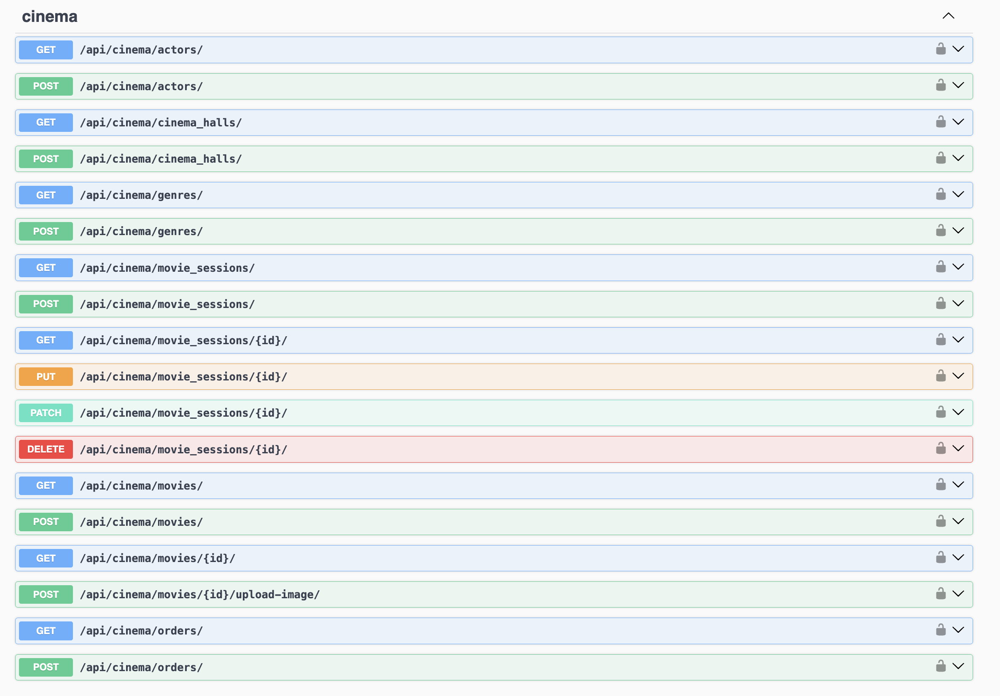
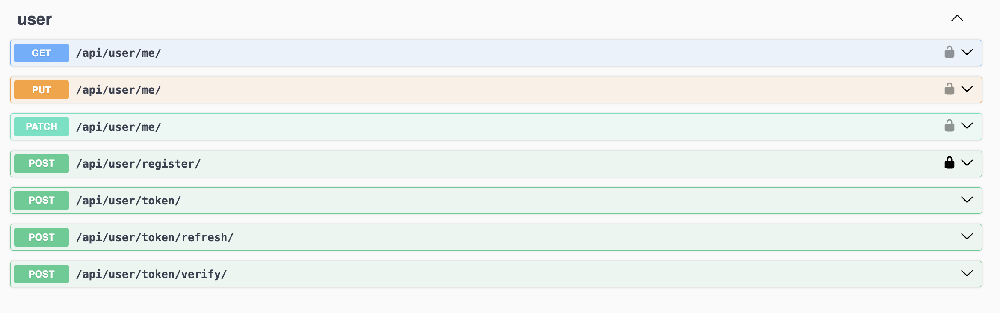

## Screens

Every page loads its data from the API. The screenshots below are taken with
**DevTools → Network** open, showing the requests to `127.0.0.1:8080`.

### Sign In / Sign Up
Authentication with JWT. On success the `access` / `refresh` tokens are stored
and attached to all further requests.
- `POST /api/user/register/` — create account
- `POST /api/user/token/` — obtain JWT pair
- `POST /api/user/token/refresh/` — refresh access token

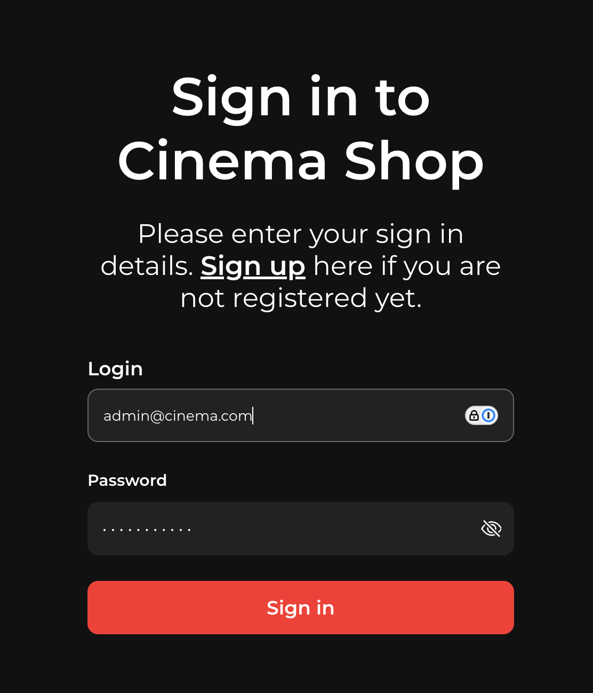

### Movies
List of all movies with filtering by actors and genres. Staff users see the
"+" button to add a new movie.
- `GET /api/cinema/movies/` (`?actors=`, `?genres=`, `?title=` filters)
- `GET /api/cinema/actors/`, `GET /api/cinema/genres/`

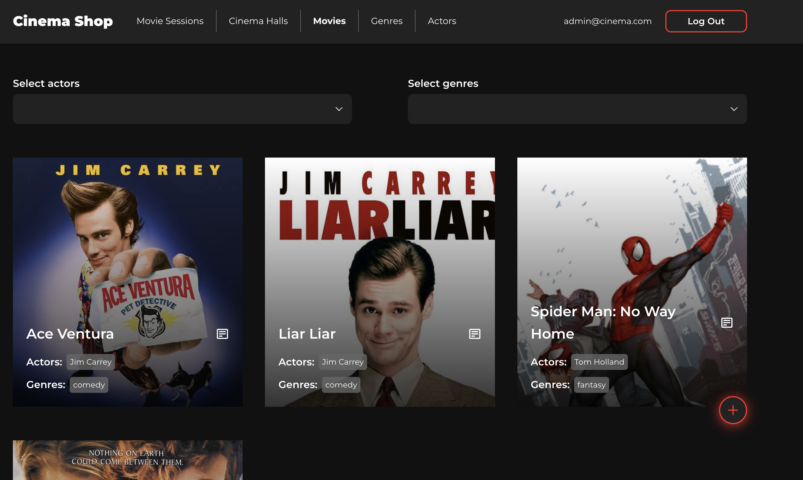
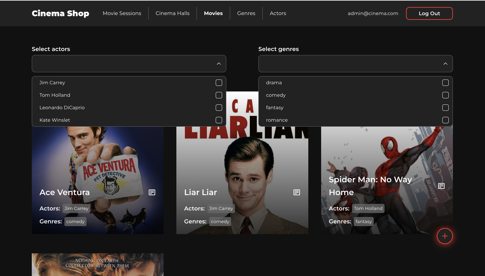

### Movie details
Full information about a single movie (description, genres, actors, poster).
- `GET /api/cinema/movies/{id}/`

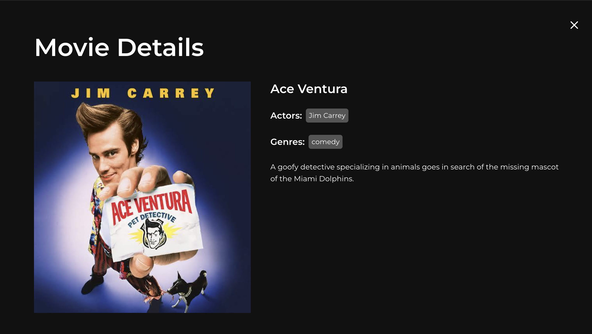

### Add movie (staff only)
Create a movie and upload its poster.
- `POST /api/cinema/movies/`
- `POST /api/cinema/movies/{id}/upload-image/`

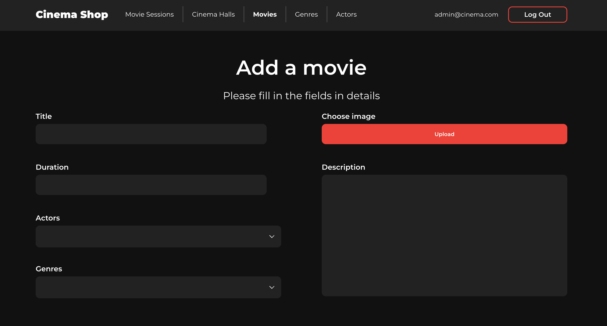

### Movie Sessions
Sessions filtered by the selected date.
- `GET /api/cinema/movie_sessions/?date=YYYY-MM-DD`

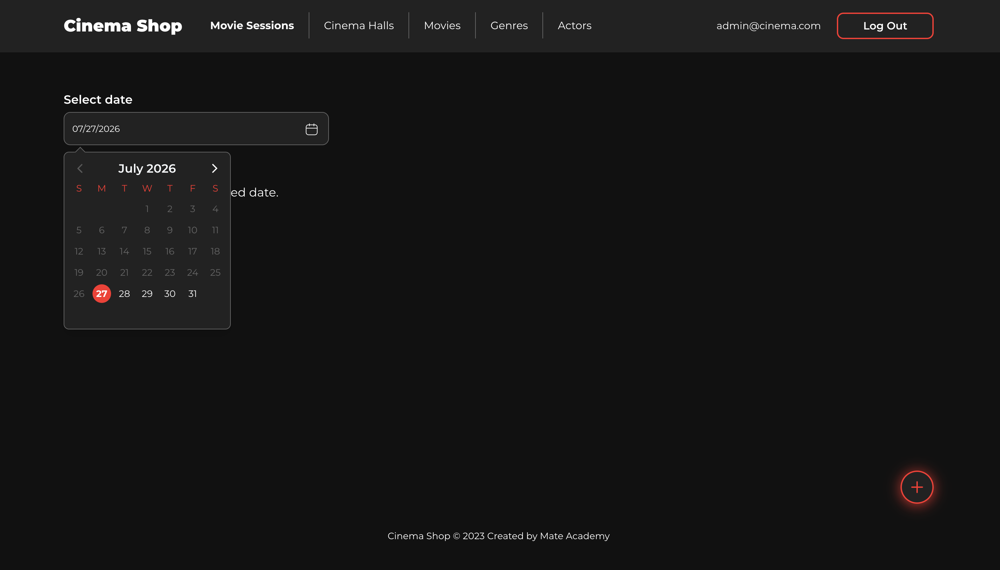

### Cinema Halls
List of halls with size and capacity, and a form to add a new one.
- `GET /api/cinema/cinema_halls/` (`POST` to create — staff)

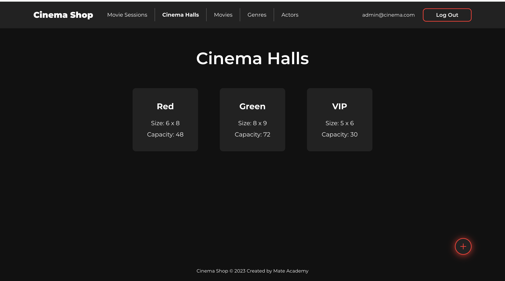
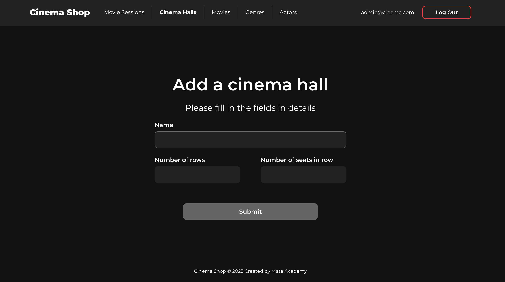

### Genres
List of all genres and a form to add a new one.
- `GET /api/cinema/genres/` (`POST` to create — staff)

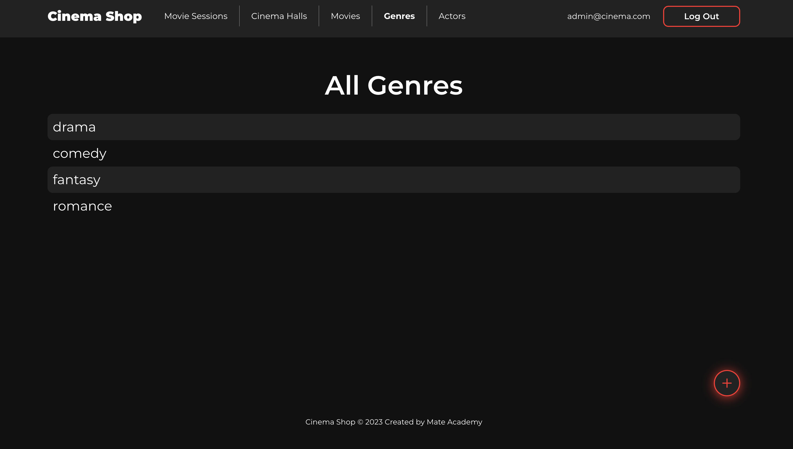
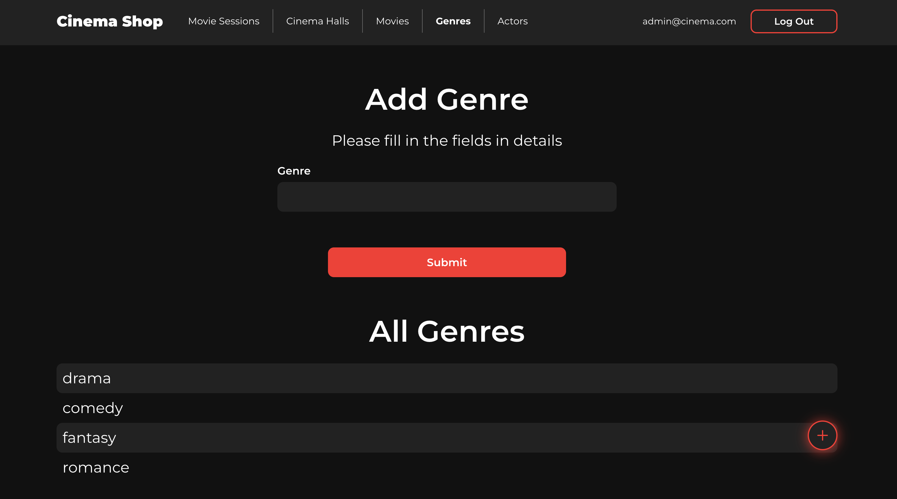

### Actors
List of all actors and a form to add a new one.
- `GET /api/cinema/actors/` (`POST` to create — staff)

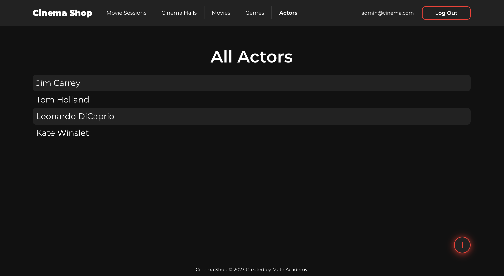
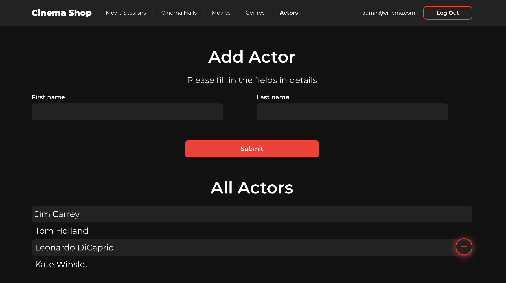
