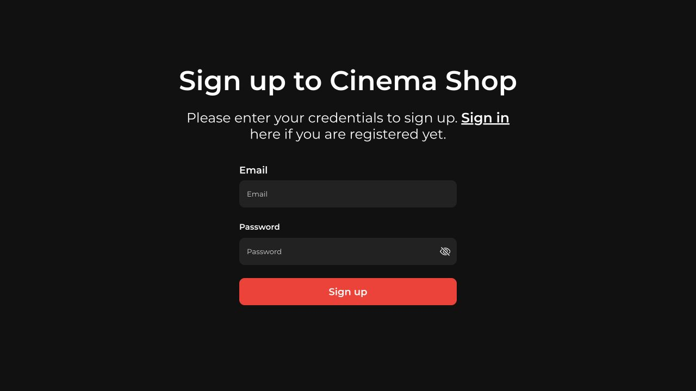
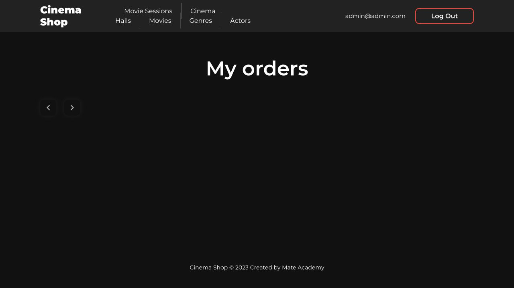
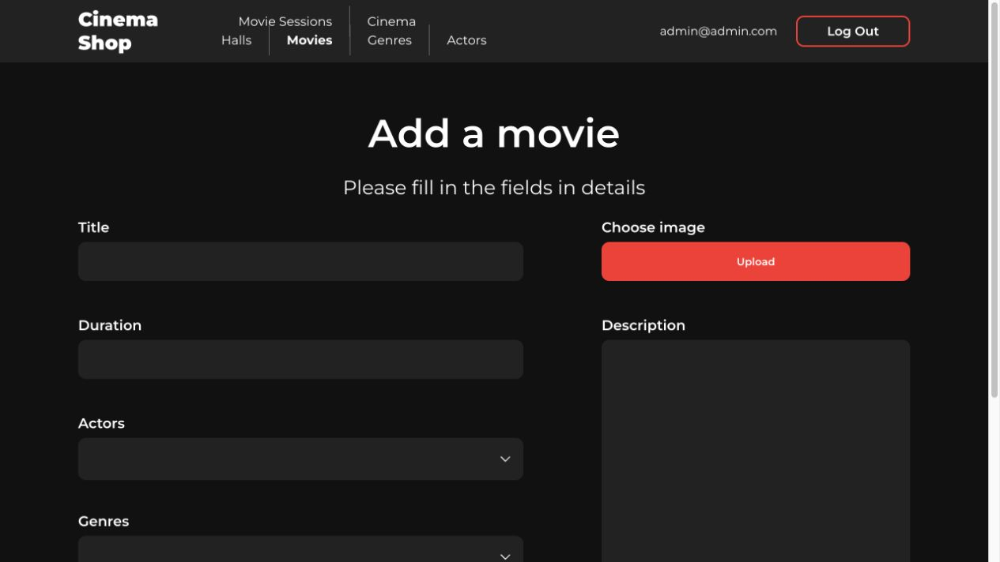
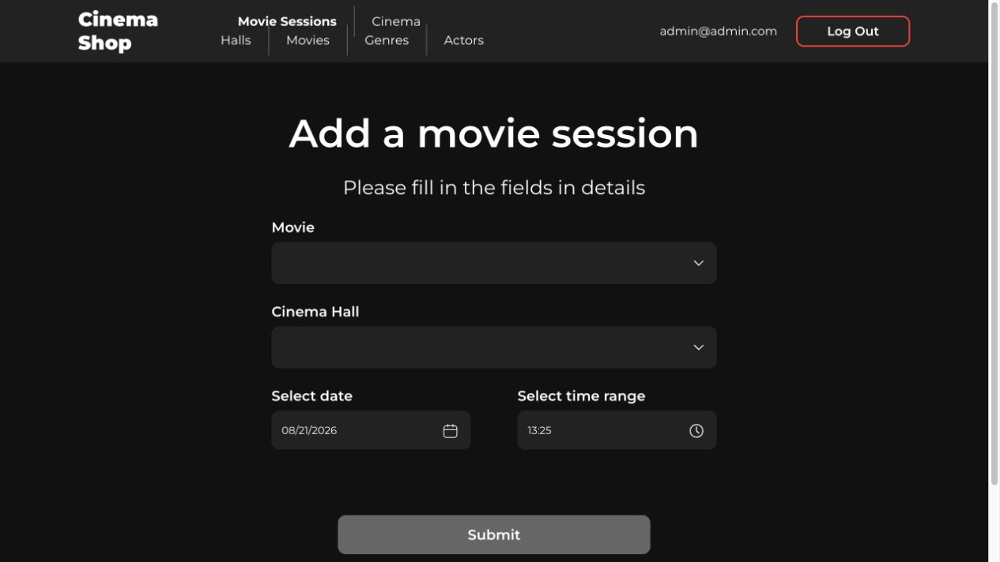
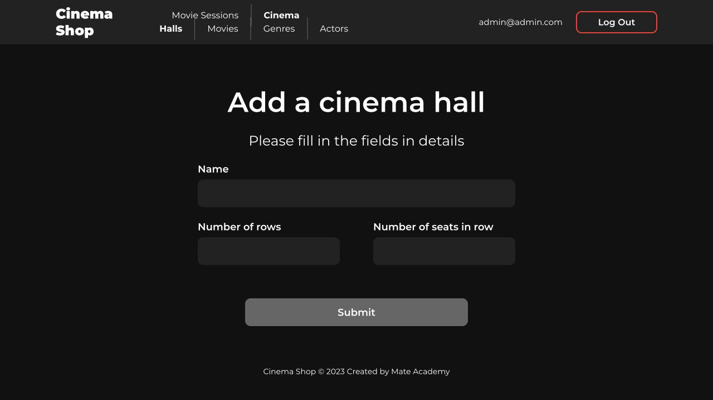

# Cinema Fullstack

- Read [the guideline](https://github.com/mate-academy/py-task-guideline/blob/main/README.md) before start

## Task:

You already have Backend and Frontend implemented.
You need to connect them together, and make sure all functionality of Cinema Shop works.

NOTE: Attach screenshots of all pages from the correctly connected frontend. Better to make them with opened developer tool, where will be shown requests to the API.

## Run locally

1. Copy `.env.sample` to `.env`.
2. Start the backend with `docker compose up --build`.
3. In `frontend`, copy `.env.sample` to `.env`, run `npm install`, and then
   `npm run dev`.
4. Open `http://127.0.0.1:5173`.

Without Docker, the backend uses SQLite automatically:

```bash
python -m venv venv
source venv/bin/activate
pip install -r requirements.txt
python backend/manage.py migrate
python backend/manage.py runserver 8080
```

## Connected frontend screenshots

| Page | Screenshot |
| --- | --- |
| Sign in |  |
| Sign up |  |
| Movies |  |
| Movie details |  |
| Movie sessions |  |
| Cinema halls |  |
| Genres |  |
| Actors |  |
| Profile |  |
| Orders |  |
| Add movie |  |
| Add movie session |  |
| Add cinema hall |  |
