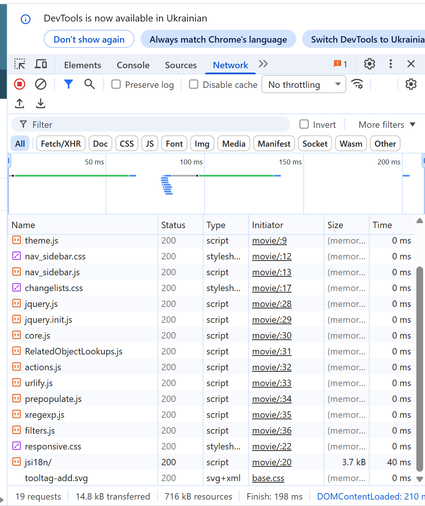
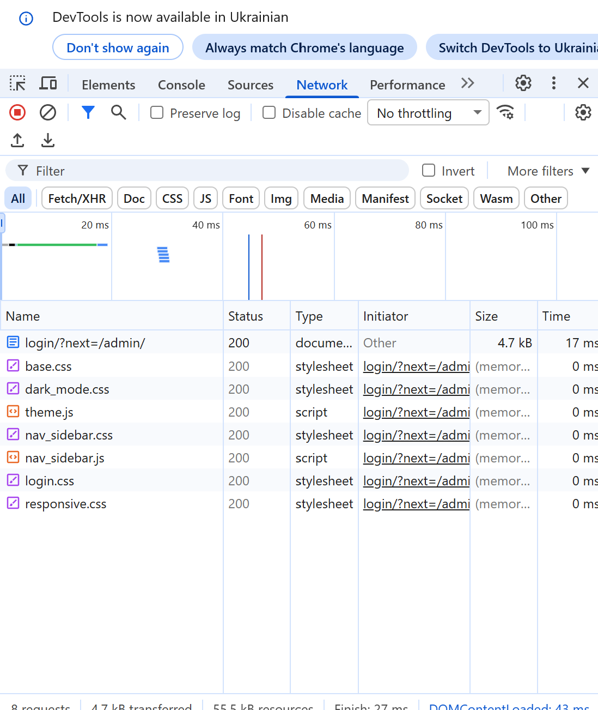
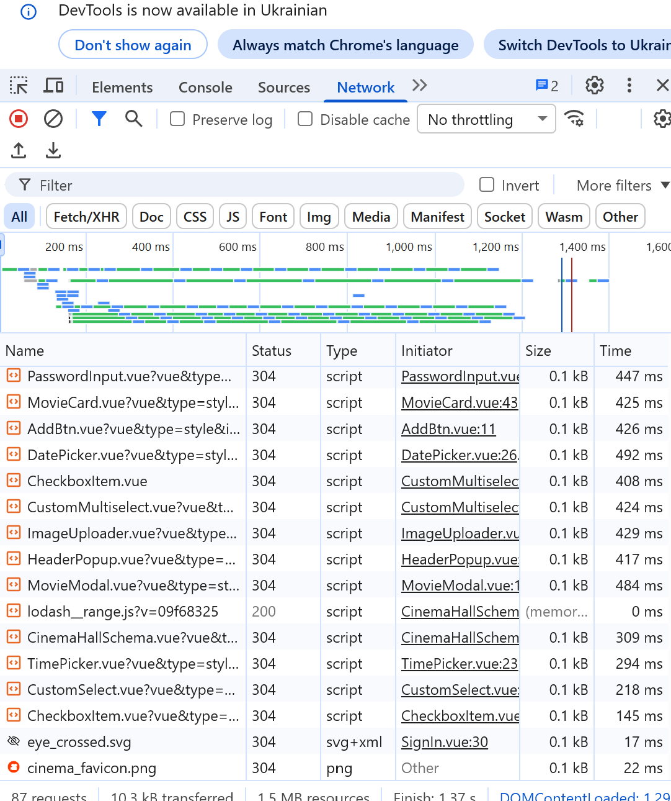
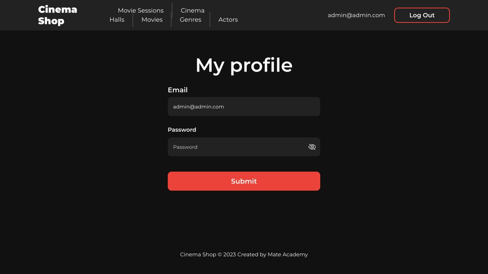
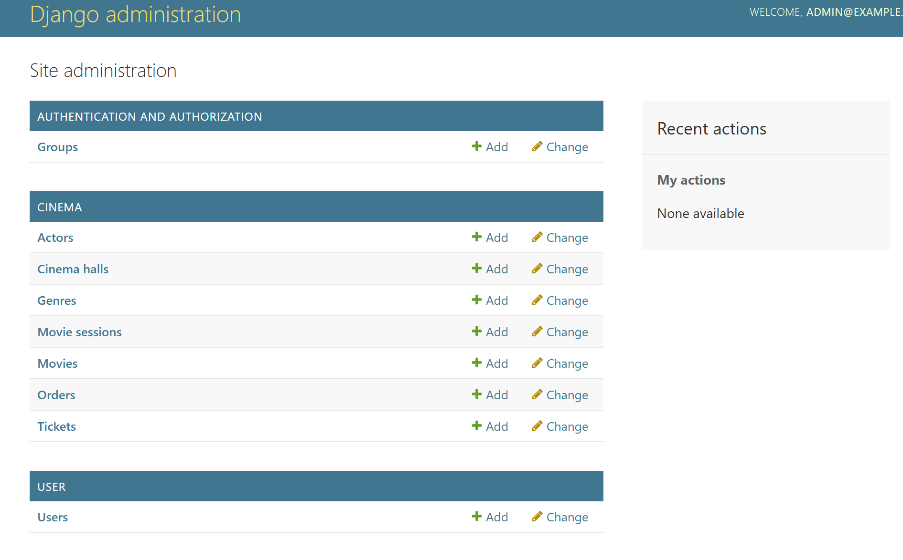

# Cinema Fullstack

- Read [the guideline](https://github.com/mate-academy/py-task-guideline/blob/main/README.md) before start

## Task:

You already have Backend and Frontend implemented.
You need to connect them together, and make sure all functionality of Cinema Shop works.

NOTE: Attach screenshots of all pages from the correctly connected frontend. Better to make them with opened developer tool, where will be shown requests to the API.

## Screenshots

Screenshots of all pages with API requests visible in DevTools:

- Home page: 
- Movie details: 
- Login: 
- Register: 
- Cart: 
- Profile: 
- Admin: 
