# Cinema Fullstack

On this `develop` branch in README.md are all successful app app screens

## Screens

### Sign in for user
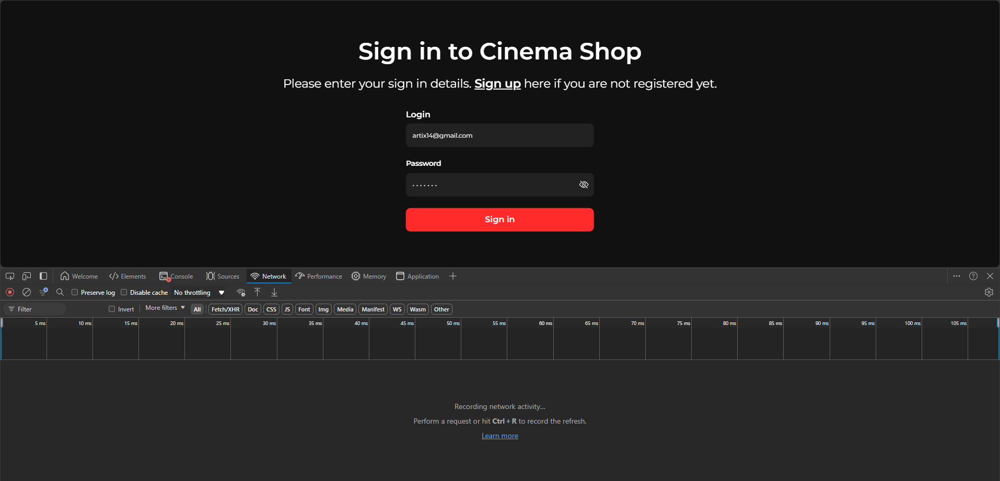
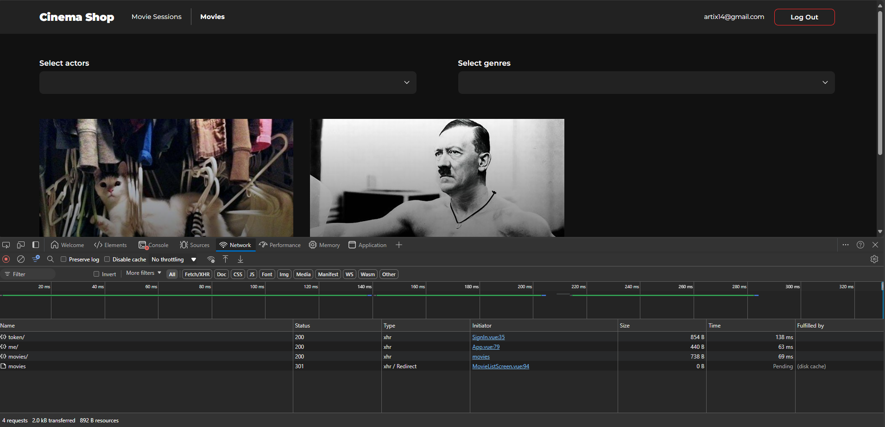

### Sign in for admin
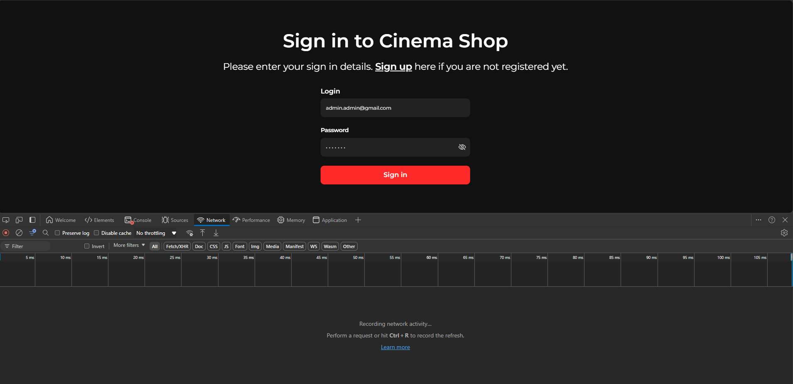
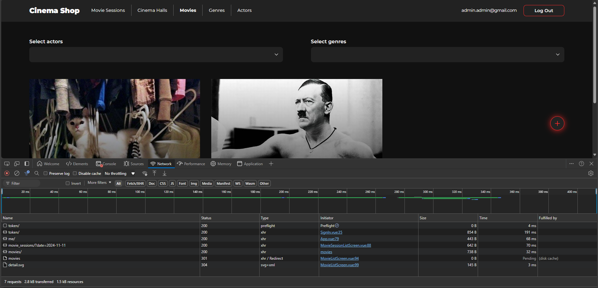

### Sign up
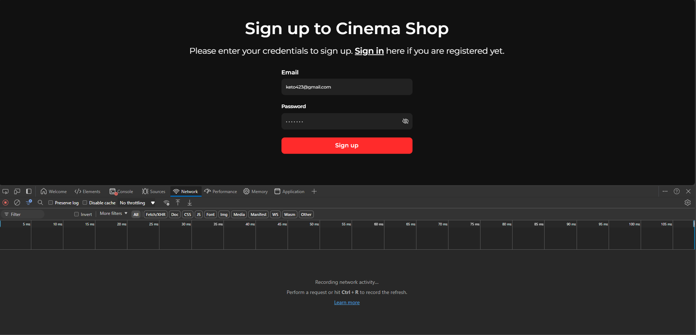
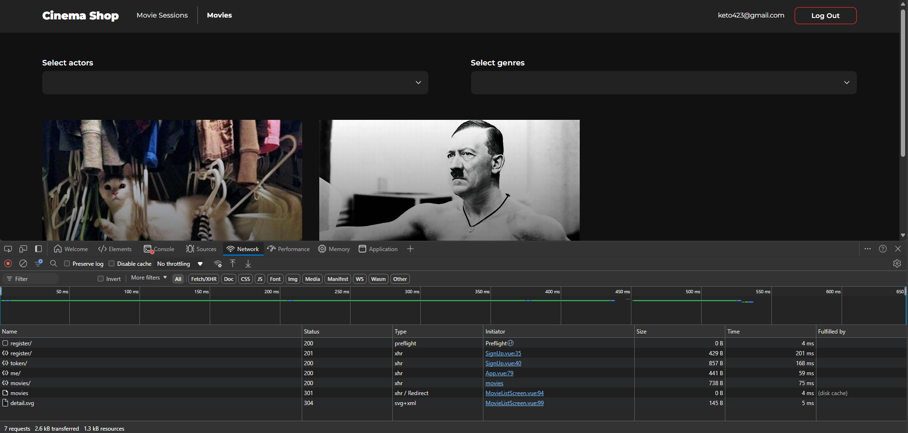

### Add actor
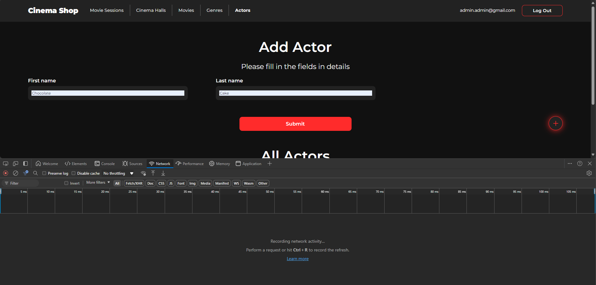
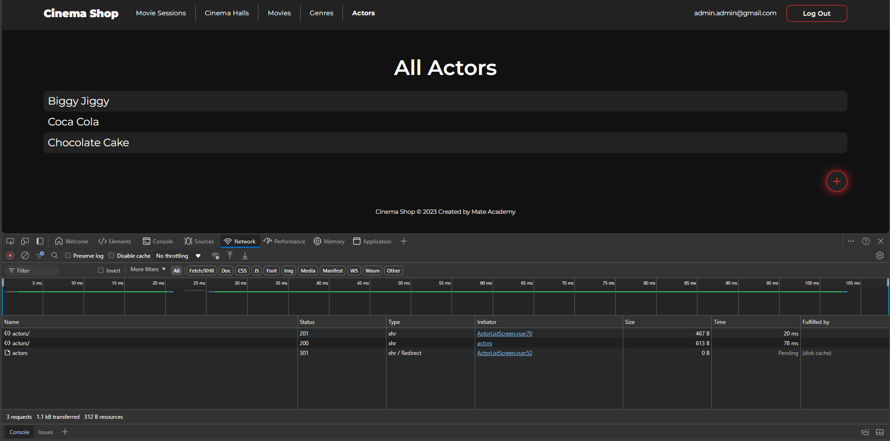

### Adding movie session
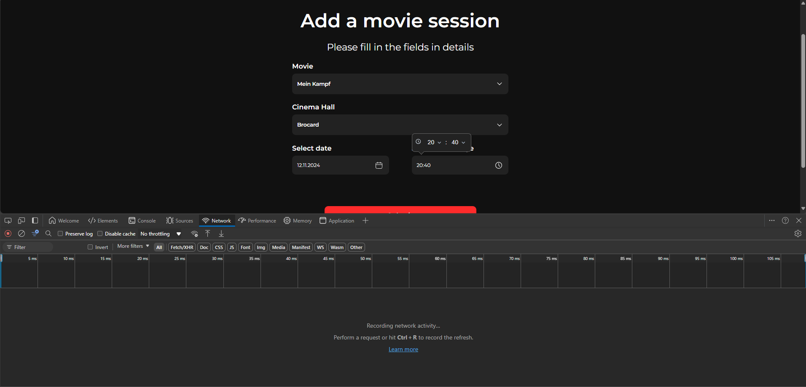
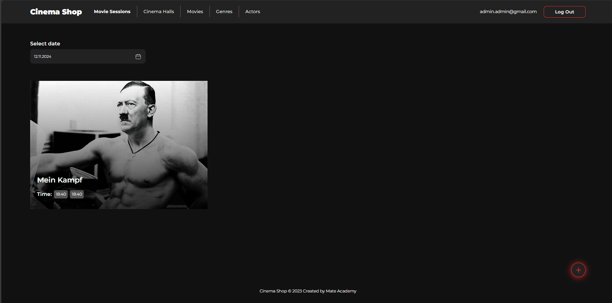

### Add movie
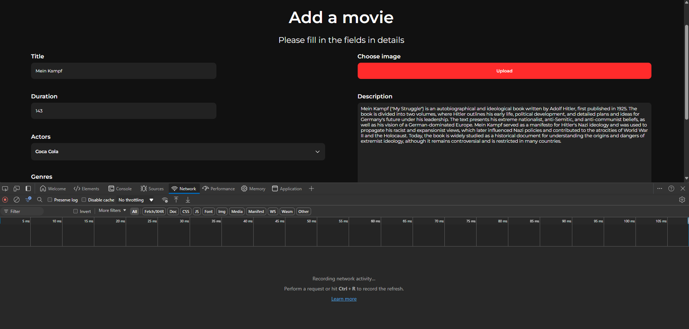
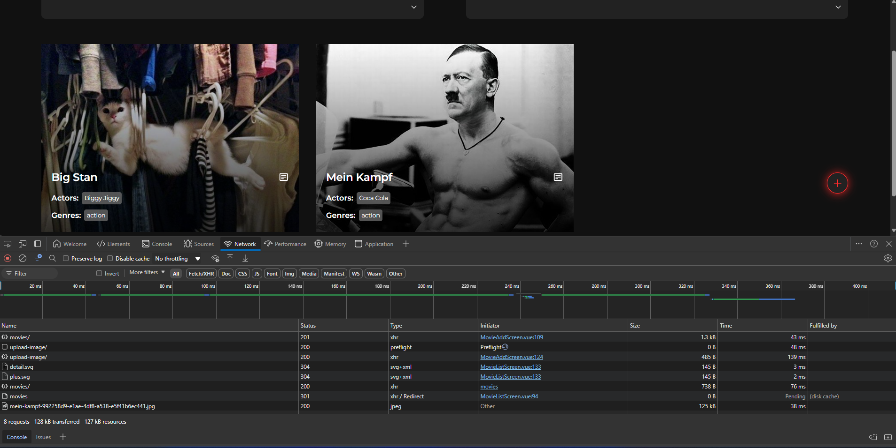

### Add genres
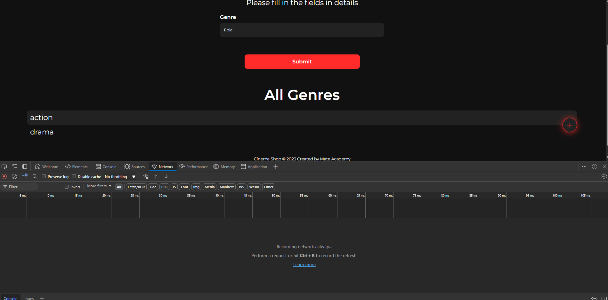
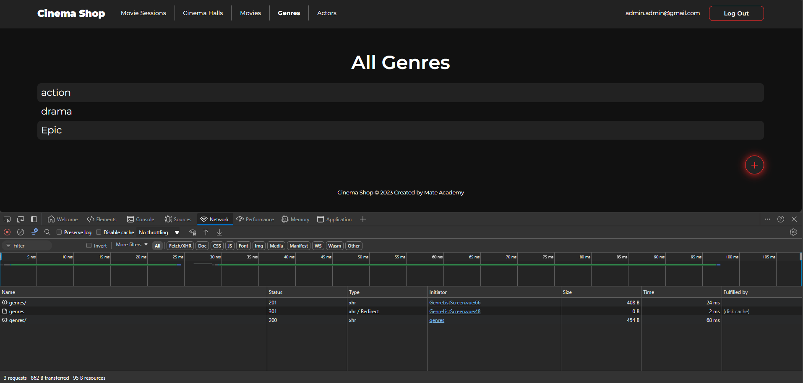

### Cinema Hall
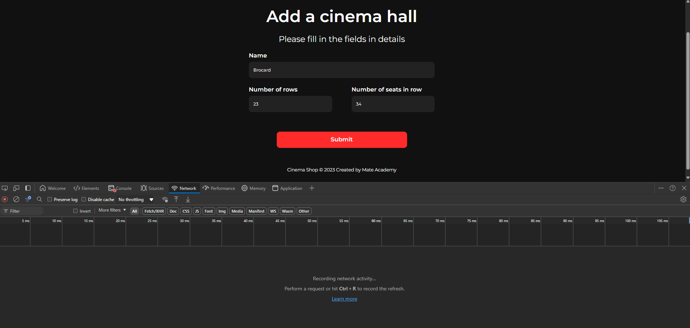
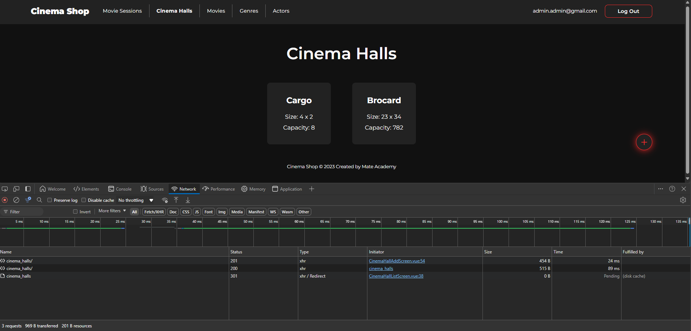

### Movie details
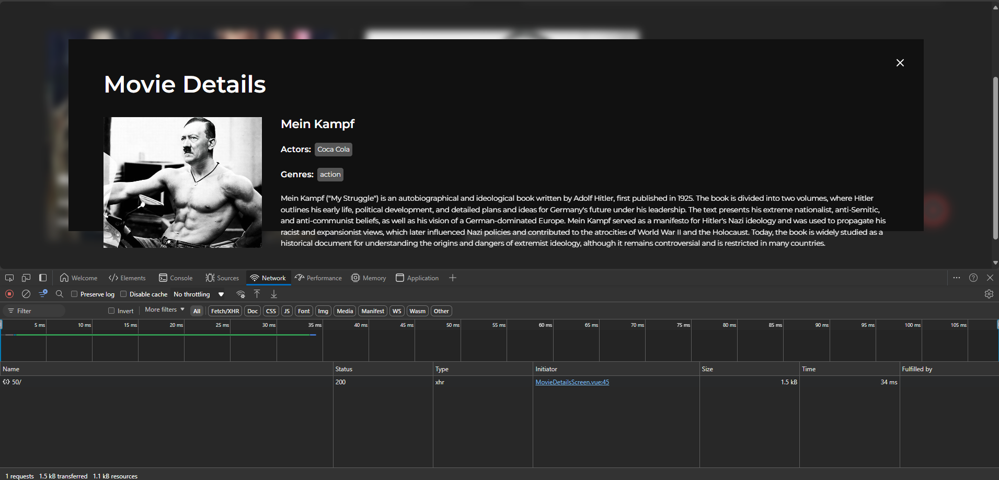

